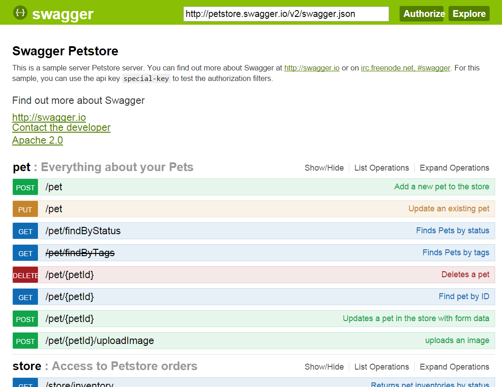

[Back to workshop overview](../README.md)

# Part 3
# Create tiered application plans with different API contracts

In this part of the tutorial we show how to use the 3scale API Management platform to configure fine-grained API contracts using tiered application plans. 

## Table of Contents
* Mapping API endpoints in 3scale
* Creating and configuring application plans
* Exploring API endpoints in API analytics
* Summary of what we achieved

## Mapping API endpoints in 3scale
After you have completed [Part 2](Part2--APImanagement.md) of this workshop, you have set up a basic connection between the Amazon API Gateway and the 3scale API Management platform for API call authorization and reporting. Now we want to fine-tune this and will start by mapping the various API endpoints into 3scale. The benefit of this is that you can then manage and control each endpoint individually.

For the workshop we use the classic [petstore](http://petstore.swagger.io/) example. You can also check out the [swagger.json](http://petstore.swagger.io/v2/swagger.json) file that represents the various petstore API endpoints. This example has a total of three resources and 19 endpoints.  

In order to map those into 3scale follow these steps:
1. Log in to your 3scale account.
2. On the main dashboard click the `API` tab. 
3. Click `Integrations` on the left hand side. This screen shows you the basic information about the integration with the Amazon API Gateway such as the base URL.
4. Next click on `Application Plans` in the navigation pane on the left hand side. 

## Creating and configuring application plans

[Application plans in 3scale](https://support.3scale.net/howtos/api-configuration#application-plans) define the different sets of access rights you might want to allow for consumers of your API. These can determine anything from rate limits, which methods or resources are accessible and which features are enabled. Let's see how we can achieve that on the 3scale API Management portal:

1. Log in to your 3scale account. You’ll see a dashboard of the most important performance figures for your API.  
2. Select the “API” tab from the navigation panel at the top. Then choose “Integration” on the left-hand side to start configuring your API management options.
`TODO: screenshot`
2. sdfsdf

## Exploring API endpoints in API analytics

## Summary of what we achieved

[Back to workshop overview](../README.md)
