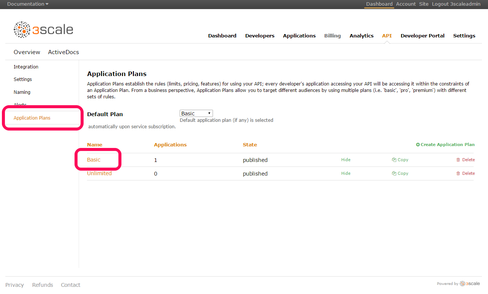
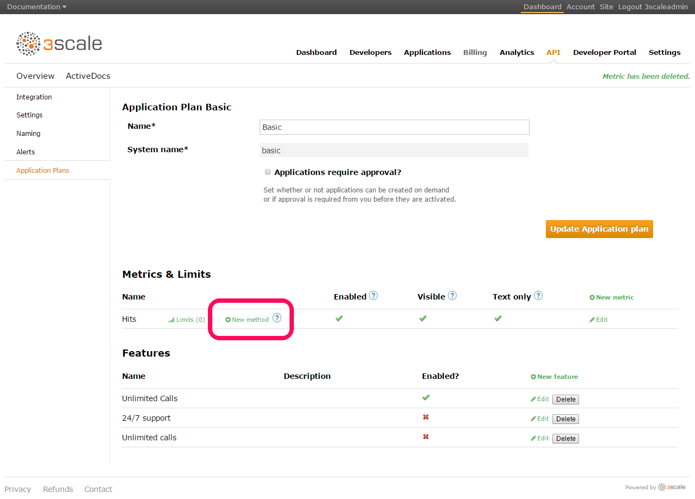
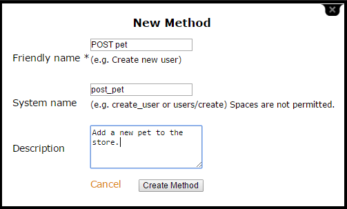
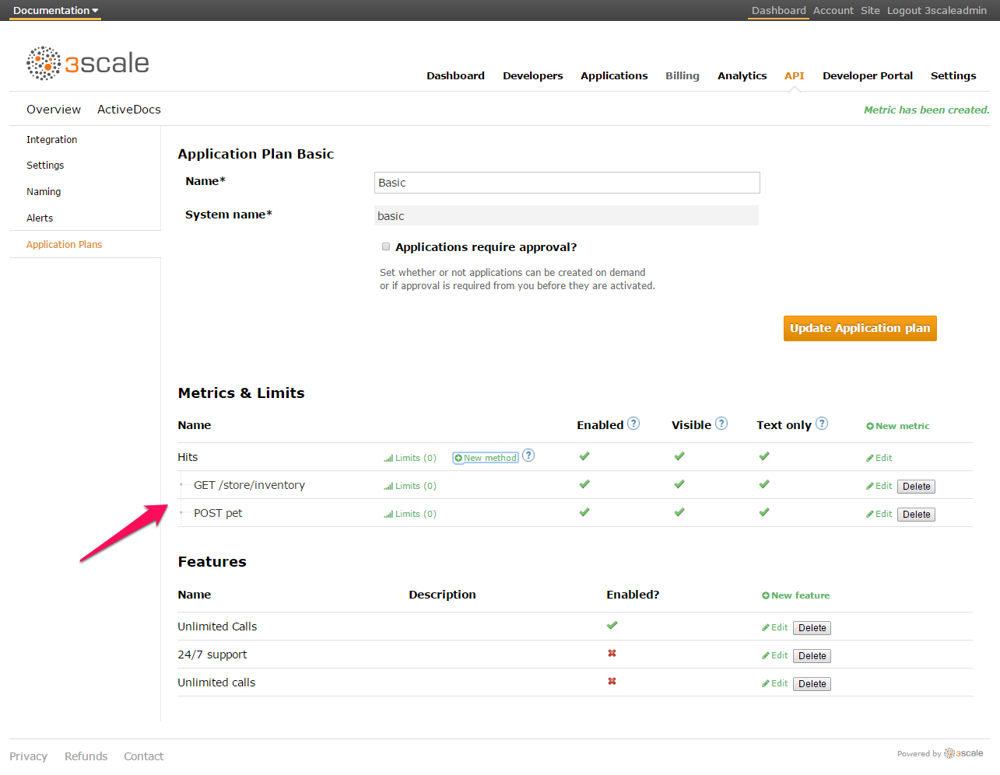
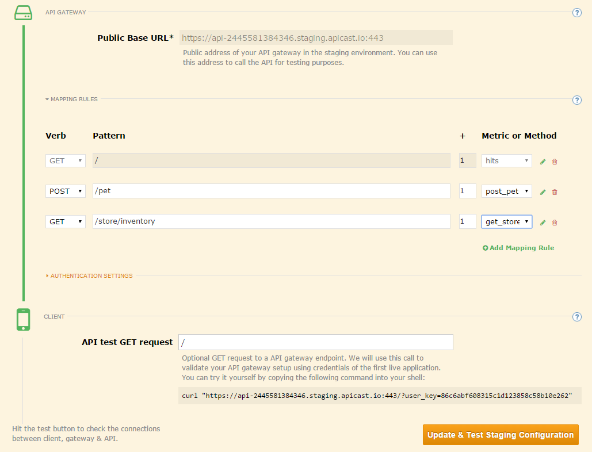
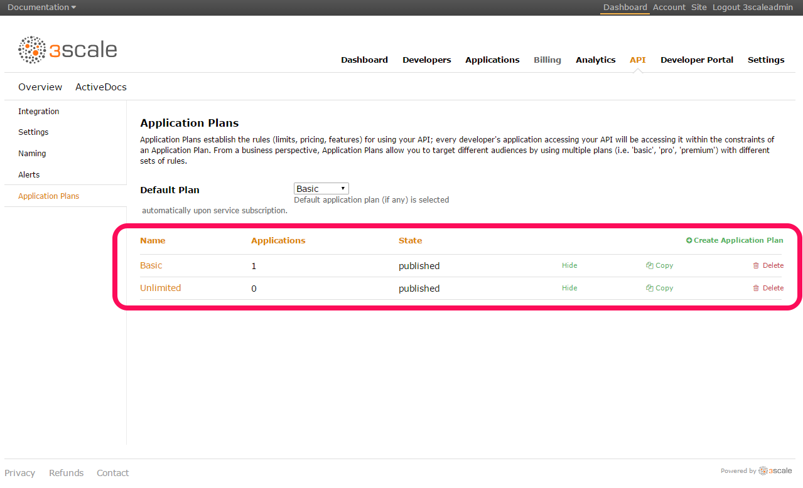
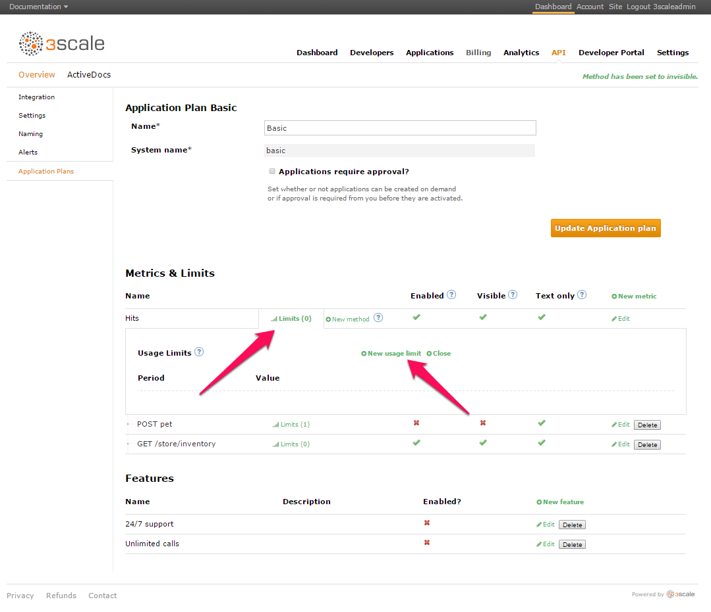
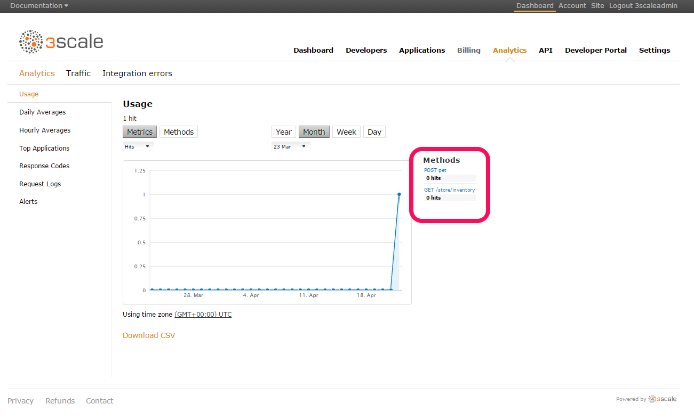

[Back to workshop overview](../README.md)

# Part 3
# Create tiered application plans with different API contracts

In this part of the tutorial we show how to use the 3scale API Management platform to configure fine-grained API contracts using tiered application plans. 

## Table of Contents
* Mapping API endpoints in 3scale ([Jump to section](#mappings))
* Creating and configuring application plans
* Exploring API endpoints in API analytics
* Summary of what we achieved
* Further resources

## Mapping API endpoints in 3scale
After you have completed [Part 2](Part2--APImanagement.md) of this workshop, you have set up a basic connection between the Amazon API Gateway and the 3scale API Management platform for API call authorization and reporting. Now we want to fine-tune this and will start by mapping the various API endpoints into 3scale. The benefit of this is that you can then manage and control each endpoint individually.

For the workshop we use the classic [petstore](http://petstore.swagger.io/) example. You can also check out the [swagger.json](http://petstore.swagger.io/v2/swagger.json) file that represents the various petstore API endpoints. This example has a total of three resources and 19 endpoints.  

In order to map those into 3scale follow these steps:

1. Log in to your 3scale account.
2. On the main dashboard click the `API` tab. 
3. Click `Integration` on the left hand side. This screen shows you the basic information about the integration with the Amazon API Gateway such as the base URL.
4. Next click on `Application Plans` in the navigation pane on the left hand side, and then choose `Basic Plan` in the middle. 

5. On the next screen you can see the various configurable methods and metrics, which we later map onto API endpoints. Initially we have no method for the specific petstore endpoints. So, let's create some. Click on `New method`. 

6. In the dialog box, let us create a method that we can later map to the `POST /pet` API endpoint.

7. Let's add another method for the `GET /store/inventory` endpoint.
8. After that you should see the two methods in your portal (see screenshot below). You can carry on an create methods for all the other endpoints too. But for the simplicity of this tutorial we carry on with just two at the moment.

9. Next we go back to the `Integration` page from the navigation bar on the left hand side. 
10. In the middle section you will see `Mapping Rules`. Unfold them. You will see that there are not mapping rules defined yet. 
11. Click on `Add Mapping Rule`.
12. Let's first map our `POST /pet` method, which we created earlier, to the corresponding API endpoint of the petstore API.
13. Choose `POST` as the verb. Add `/pet` as the relative endpoint URL. And choose our corresponding method from the dropdown list which is `post_pet`.
14. Go ahead and do the same for all the other methods you created earlier. In our case, we made another one for `GET /store/inventory`. When done your portal will show the mapping rules something like this:

15. Finally click `Update & Test Staging Configuration` to confirm the changes and run a simple test.

After you have completed these steps, you now have a very fine-grained way of managing and controlling every petstore API endpoint individually. 

As a next step, we want to configure different application plans on top of our managed API endpoints. Application plans are one of the key benefits of API management because they allow you to configure and provide different services and service levels to your different API consumer segments. 

## Creating and configuring application plans

[Application plans in 3scale](https://support.3scale.net/howtos/api-configuration#application-plans) define the different sets of access rights you might want to allow for consumers of your API. These can determine anything from rate limits, which methods or resources are accessible, which features are enabled and also let you define to charge for access to the API based on a business model that you choose. You can find [more information here](https://www.3scale.net/api-management/monetize/) about API monetization. But for now, let's see how we can achieve the creation of application plans on the 3scale API Management portal:

1. Log in to your 3scale account.  
2. On the dashboard, select the `API` tab from the navigation panel at the top. 
3. Then choose `Application Plans` on the bottom left-hand side. You will then see that there are two application plans pre-configured by default `Basic` and `Unlimited`.

4. Click on the `Unlimited` application plan first to check it out. In the middle part you can see that both the two methods we configured earlier (`POST /pet` and `GET /store/inventory`) are both visible and enabled for this plan and there are no limits set. This means that a developer on this plan can call the API endpoints as often as s/he wants. Also this plan offers other services like 24/7 phone support etc.
5. Now let's check and configure the `Basic` plan. Go back to the overview of the plans and click on `Basic`.
6. You will see that the features at the bottom like 24/7 phone support are all disabled. But the accessibility of methods at the top are the same as for the `Unlimited` plan. But we want to have different plans in order to provide different services to different API consumer segments and maybe even charge for the higher value `Unlimited` plan. So let's change this.
7. First, on the `Basic` plan we don't want API consumer give access to the `POST /pet` endpoint to prevent them from creating new pet resource. For that, just uncheck the tick in the `Enabled` column and also make it invisible in the `Visible` column. 
8. Next we want to limit the total number of API calls a consumer on that plan can execute. For that, click on `Limits` and then `New usage limit`.

9. On the next dialog you can choose the period (eg, day) and the max value (eg 5000).
10. Click `Create usage limit`.
11. And with that we have limited the number of total API calls allowed for an API consumer who has an app that is related to the `Basic` plan to 5000 per day. 

We have now finished our configuration of application plans. Of course, you can also get rid of the default plans and/or add your custom plans to your 3scale API Management account. In part [Part 4](Part4--DevPortal.md) of this tutorial we will show how to expose application plans to developers via developer portals and let them sign up.

## Exploring API endpoints in API analytics

A further beneficial consequence of having fine-grained API endpoint mappings is that we can also analyse each endpoint individually, understand how often a certain endpoint is called, from what app, what error codes are returned when, and a lot more. 

To see how that works, switch to the `Analytics` tab in your 3scale dashboard. 
What you will see there at a first glance is the total number of API calls accumulated across all endpoints. On the right-hand side, you can drill down to get an accurate count of API calls against each endpoint. See below:

If you define more method to API endpoint mappings as described in the first section [above](#mappings) then you will see all these methods in the list on the right too, as indicated in the screenshot above.

API analytics is another very powerful feature of API management. It gives an API provider full visibility about what is important to know for the organization. API analytics can also be set up for automatic reporting or alerts. With the intelligence gained from that API providers can make better decisions about the API strategy or in fact their digital strategy.  

## Summary of what we achieved
In this part 3 of the workshop we covered how in 3scale methods can be created to make them onto API endpoints. This give us the power of managing and controlling APIs on a much more fine-grained and detailed level down to each individual endpoint. API analytics leverage that too giving us more insight about the actual usage of the API which informs future decision making. Finally, on top of the method to endpoint mapping an API provider can create different application plans that can be used to offer difference service levels to different API consumer segments.

## Further resources
You can find a lot more detailed information about what you can do with 3scale’s rate limiting, analytics features, and application plans features on the [3scale Support](https://support.3scale.net/get-started/quickstarts/3scale-api-analytics) pages. 

[Back to workshop overview](../README.md)
